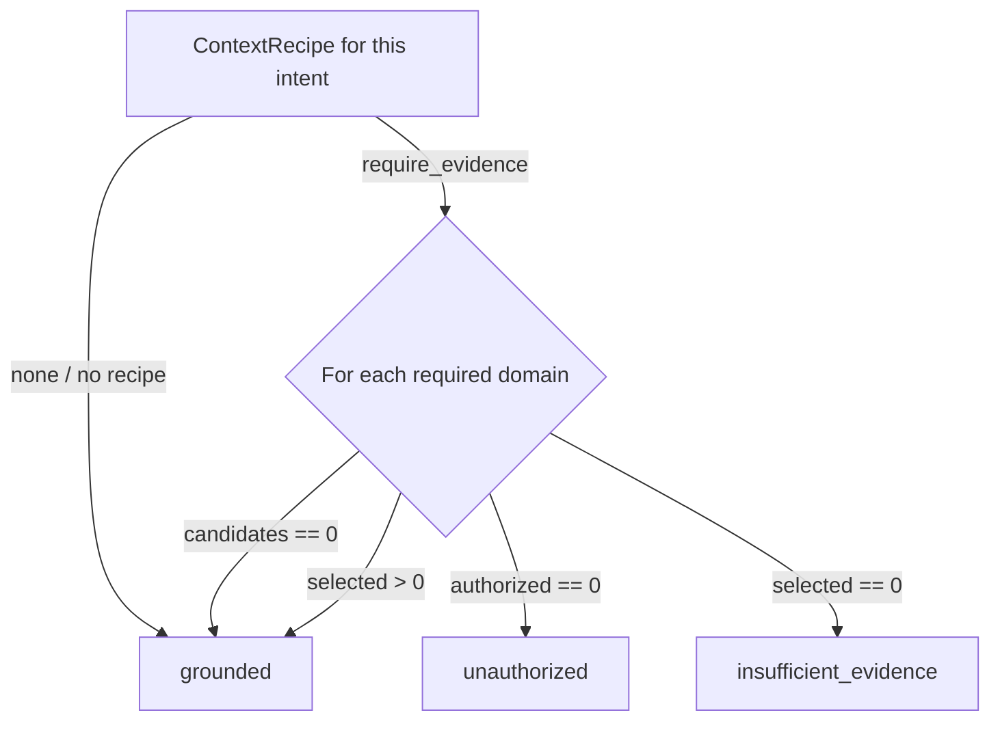

# Context runtime (MUSE-adoption addendum)

This document is a short addendum to
[`context-semantic-runtime.md`](context-semantic-runtime.md), which remains the canonical
description of Soko's context retrieval/assembly pipeline. It covers only what the MUSE-adoption
change (see [`muse-adoption-audit.md`](muse-adoption-audit.md)) added on top of that pipeline:
**diagnostics** and the **grounding gate**. Evidence provenance/confidence and context recipes have
their own documents ([`evidence-graph.md`](evidence-graph.md), [`context-recipes.md`](context-recipes.md)).

## What changed

`retrieveAgentContext` (`services/api/src/cp2/agent-business-runtime.ts`) is now a thin wrapper
around `resolveAgentContext`, which does the same relevance scoring and character-budget packing as
before, plus a `ContextSelectionDiagnostics` object built in the same pass (no second query):

```ts
interface ContextSelectionDiagnostics {
  candidateNodes: number;   // every source of this type/audience Soko holds for the business
  selectedNodes: number;    // items actually packed into the prompt
  rejectedNodes: number;    // candidateNodes - selectedNodes
  estimatedTokens: number;  // ~4 chars/token, matching contextCharacterBudgetForModel's own estimate
  tokenBudget: number | null;
  byDomain: Partial<Record<AgentContextSourceType, { candidates; authorized; selected }>>;
}
```

`byDomain` is the load-bearing part: for each `AgentContextSourceType`, it tracks how many sources
of that type exist at all (`candidates`), how many pass the audience/status authorization filter
(`authorized`), and how many actually made it into the prompt (`selected`). This three-tier
breakdown is what the grounding gate (below) reads to distinguish "there really is nothing to find"
from "the caller can't see it" from "it exists but wasn't retrieved."

Every runtime turn now emits a `context.plan.completed` telemetry event carrying the aggregate
counts (never `byDomain`'s content, and never source content itself - only counts).

## The grounding gate

`evaluateGrounding` (same file) turns the diagnostics above into one of the brief's four decision
states (`GroundingDecision`, `packages/shared-types`):



A domain with zero real candidate records is treated as grounded: "this business has none" is
itself a correct, evidenced answer, not a guess. See [`runtime-grounding.md`](runtime-grounding.md)
for where this is actually wired into `executeRuntimeTurn`, and why it is a narrow override on the
model's own free-text output rather than a pre-inference block on every turn.

## Security note

Diagnostics and grounding decisions never change *what* is authorized - `resolveAgentContext`'s
authorization filter (status/deletedAt/audience/customerVisible) runs exactly as it did before this
change, before any content is scored or packed. The grounding gate can only narrow an already-
resolved turn further (by substituting a fixed abstention message); it never grants access to
anything the authorization filter excluded.
