# Context Semantic Runtime

This document describes Soko's existing agent-context runtime and the small,
bounded enhancements added to it (task-aware context narrowing and
model-aware context budgeting). It complements
[`docs/agent-context-instructions-personality.md`](../agent-context-instructions-personality.md)
(instruction precedence and personality) and
[`docs/agent-business-runtime.md`](../agent-business-runtime.md) (the wider
agent-runtime feature). For the evidence behind every claim below, see
[`context-semantic-runtime-audit.md`](context-semantic-runtime-audit.md).

## Purpose

Turn per-shop agent context (catalogue, inventory, customer records,
supplier records, receipts, orders, policy, documents, conversations,
owner-authored context scripts, owner notes) into typed, versioned,
authorized objects that are selected by task relevance and packed into a
model-independent prompt, rather than being concatenated wholesale into
every request.

## Architectural boundaries

- **Model-independent**: `assembleAgentInferenceMessage` produces a single
  string handed to `ModelRuntimeAdapter.generate`/`RuntimeModelProvider.complete`
  (`services/api/src/inference/model-runtime.ts:46`); provider-specific
  request shaping (Ollama, OpenAI) lives only inside the adapters.
- **One assembler, one precedence order**: `compileAgentInstructions` /
  `assembleAgentInferenceMessage`
  (`services/api/src/cp2/agent-business-runtime.ts:119,188`) is the only
  place a prompt is built for this flow.
- **One tool/MCP surface**: MCP's `soko.runtime_turn` tool
  (`services/api/src/mcp/routes.ts:146`) calls the same
  `Cp2Store.createRuntimeTurn` used by the REST endpoint — no parallel
  context or tool resolution path exists for MCP callers.
- **No duplicated canonical data**: context sources reference business
  records (`retrievalMetadata.sourceRecordId`); the context runtime does not
  own a second copy of catalogue/customer/order data.

## Request lifecycle

```mermaid
flowchart LR
    UI[POST businesses/:id/runtime/turns]
    AUTH[requireAuthorizedSession]
    INTENT[parseMerchantCommand / context-script matchers]
    RETRIEVE[retrieveAgentContext]
    BUDGET[character-budget packing]
    ASSEMBLE[assembleAgentInferenceMessage]
    ROUTER[createRuntimeModelRoute]
    MODEL[Ollama / OpenAI / owner-node / browser adapter]
    PARSE[parseRuntimeModelOutput]
    POLICY[enforceAgentPolicy + confirmation gating]
    TOOLS[executeRuntimeAction]
    STORE[(cp2_* tables via Cp2Store)]

    UI --> AUTH --> INTENT --> RETRIEVE
    STORE --> RETRIEVE
    RETRIEVE --> BUDGET --> ASSEMBLE --> ROUTER --> MODEL --> PARSE --> POLICY --> TOOLS --> STORE
```

1. **Identity resolution**: `requireAuthorizedSession` checks the session
   cookie and `business:read` membership before anything else runs
   (`store.ts:10238`).
2. **Task classification**: deterministic, not model-based. Context-script
   matchers run first; `parseMerchantCommand`
   (`packages/tool-core/src/index.ts:1480`) is the fallback deterministic
   parser (`store.ts:10391-10407`).
3. **Context planning + authorization + resolution**: `retrieveAgentContext`
   (`agent-business-runtime.ts:230`) filters by `status`, `deletedAt`,
   `accessRules.audiences`, `customerVisible` — **before** any content is
   exposed to the caller — then narrows by the recognized intent's eligible
   categories, scores by keyword relevance, sorts by relevance then
   freshness, and packs the top matches within a character budget.
4. **Conflict/precedence**: `compileAgentInstructions` emits an explicit,
   fixed precedence order (platform security → tenant identity → business
   policy → personality → task → retrieved context → tools → memory →
   output contract); lower sections cannot expand permissions granted by
   higher ones (enforced structurally — retrieved context and memory are
   always wrapped as "untrusted data" and neutralized, never merged into the
   policy sections).
5. **Assembly**: `assembleAgentInferenceMessage` renders the above into one
   string, wrapping each context/memory item in an explicit
   `<context source=... type=... sensitivity=...>` delimiter after
   `sanitizeUntrustedContext` neutralizes instruction-like lines.
6. **Model dispatch**: `createRuntimeModelRoute` resolves the shop's active
   model binding to a `ModelRuntimeAdapter`, normalizes it to a
   `RuntimeModelProvider`, and calls it.
7. **Result validation**: `parseRuntimeModelOutput` requires valid JSON with
   a known `type` discriminator; tool proposals go through
   `validateRuntimeToolInput` before anything else touches them.
8. **Tool execution**: `enforceAgentPolicy` (discount ceilings, credit
   terms, restricted actions, catalogue-modification flag) runs after
   inference and before execution; confirmation-requiring actions mint a
   token and wait for `confirmRuntimeAction` rather than executing
   immediately.
9. **Persistence**: the turn (context used, plan, verification, telemetry)
   is stored via `storeRuntimeTurn`.

## Context domains → source types

| Domain | `AgentContextSourceType` |
|---|---|
| Business/catalogue | `catalogue`, `inventory` |
| Customers | `customer` |
| Suppliers | `supplier` |
| Financial records | `receipt`, `order` |
| Policy | `policy` |
| Documents | `document` |
| Conversation history | `conversation` |
| Owner-authored scripts | `context_script` |
| Free-form notes | `owner_note` |

## Deterministic task-to-context planning (added)

`retrieveAgentContext` accepts an optional `intent: RuntimeParserIntent`.
A fixed map (`intentContextTypes` in `agent-business-runtime.ts`) narrows
eligible source types per recognized intent — e.g. `show_products` only
considers `catalogue`/`inventory` (plus the always-eligible `policy` and
`context_script` categories); `add_customer` only considers `customer`.
`"unknown"` is the documented fallback: no narrowing, identical to the
prior behavior, so a stock question is not answered using supplier or
receipt records, but an unrecognized message still sees the full candidate
set rather than silently losing context. The mapping is a plain lookup
table — deterministic for equal inputs, no model call involved in planning.

## Model-aware context budgeting (added)

`retrieveAgentContext` accepts an optional `characterBudget`. Candidates
(already relevance-sorted) are packed greedily: the top match is always
kept even if it alone exceeds the budget (so a relevant task never
silently receives zero context); subsequent items are included only if
they fit the remaining budget. `Cp2Store.createRuntimeTurn` computes this
budget via `contextCharacterBudgetForModel`, which reads the resolved
model's declared context window and reserves a conservative 25% share of it
(at ~4 characters/token, since no exact tokenizer is wired into this
service) for retrieved context — the remainder is implicitly left for
platform/policy/personality instructions, tool schemas, conversation
history, and the model's output allowance. See "Per-model context
budgeting" below for how that context window is resolved across both
model catalogs.

## Observability (extended)

The existing `model.prompt_built` telemetry event
(`RuntimeTelemetryEvent`, part of every persisted turn) now also records
`retrievedContextTypes` (comma-joined distinct types actually selected) and
`intent`, alongside the pre-existing `retrievedContextCount`. No new event
taxonomy was introduced — this reuses the existing telemetry mechanism so
selection decisions are visible per turn without adding a parallel logging
path. Sensitive content itself is never logged; only counts, types, and the
recognized intent are.

## Failure modes

- Missing/unauthorized context source → filtered out before content is
  ever read into the assembled prompt; the model simply sees fewer
  `<context>` blocks (or "No relevant context retrieved.").
- Unavailable model adapter → `AGENT_MODEL_UNAVAILABLE`/`AGENT_MODEL_NOT_CONFIGURED`
  errors are thrown before any context is discarded.
- Malformed model output → `parseRuntimeModelOutput` rejects it; no
  privileged action is inferred from free text.

## Extension process

To add a new context category: add the `AgentContextSourceType` value in
`packages/shared-types`, add it to the relevant intents in
`intentContextTypes` (or leave it out of every intent and rely on the
`"unknown"` fallback plus explicit querying), and ensure any writer sets
`accessRules` correctly. No changes to the assembler, model router, or tool
runtime are needed for a new context type.

## Caller audience derivation (fixed)

`Cp2Store.createRuntimeTurn` no longer hardcodes `audience: "owner"`. It
now calls `agentAudienceForBusinessRole(role)`
(`agent-business-runtime.ts`) with the authenticated caller's real
business-membership role: only `role === "owner"` maps to the `"owner"`
audience; every other role (`manager`, `sales_agent`, `cashier`,
`view_only`) maps to `"staff"`, so non-owner staff members calling their
shop's agent no longer receive owner-only context sources. `"customer"` is
still never derived here — this endpoint requires `business:read` business
membership, and there is no non-member, customer-facing chat entry point in
the repository today. Building one was out of scope for this change (it
would be new, unrelated feature work); when it exists, its handler should
call the same `agentAudienceForBusinessRole`-style mapping (or an
equivalent for non-member callers) rather than reintroducing a hardcoded
audience.

## Per-model context budgeting (fixed for all catalog entries)

`AiModelSummary.contextWindow` (`packages/shared-types`) is now a required
`number | null` field, so every entry in `aiModelRegistry` makes an
explicit, reviewable choice:

- Pinned local GGUF artifacts (SmolLM2, both TinyLlama quantizations, both
  Qwen2.5 sizes) declare their real model-card context length.
- The two operator-configurable cloud profiles (`openai-fast`,
  `openai-reasoning`) read a new conservative, env-configurable value
  (`OPENAI_FAST_CONTEXT_WINDOW_TOKENS`, `OPENAI_REASONING_CONTEXT_WINDOW_TOKENS`,
  default 32,000, via the file's existing `readBoundedSecurityInteger`
  helper) rather than a value hardcoded to today's default hosted model —
  the actual model behind each profile is chosen by an env var
  (`OPENAI_FAST_MODEL`/`OPENAI_REASONING_MODEL`) and can change without a
  code deploy, so its window is configured the same way.
- `sokoclaw-local` (a deterministic, non-token-based fallback) and
  `llama-cpp-configured` (an installed app's own model choice, unknown to
  the server) are explicitly `null`, as are dynamically discovered
  GitHub/Hugging Face catalog entries — all for the same reason: their true
  context window is not centrally knowable, so it is left unstated rather
  than guessed.

`contextCharacterBudgetForModel` checks `runtimeModels` first, then
`aiModelRegistry`, and only falls back to the fixed conservative default
for the entries above that are intentionally `null`.

## Untrusted-content truncation (hardened)

`sanitizeUntrustedContext` previously cut content at a flat 4,000-character
index, which could split a structured token (a price, an identifier) in
half. It now cuts at the nearest preceding whitespace instead, and appends
a `[content truncated]` marker whenever it actually shortens the content —
so truncation is never silent and a token is never left half-present. Short
content and instruction-neutralization are unaffected.

## Test coverage at the real integration seam (hardened)

Two mechanisms added earlier in this change (task-aware selection,
budgeting, audience derivation) were originally proven only by unit tests
against the exported pure functions. A second pass added HTTP-level tests
that drive the real `/businesses/:id/runtime/turns` endpoint:

- One captures the model prompt for both an owner call and a non-owner
  staff call against the same business and an owner-only context source,
  and asserts the owner-only content appears only in the owner's prompt.
- One reads `turn.telemetry` from the live HTTP response and asserts the
  `model.prompt_built` event's `retrievedContextTypes`/`intent` fields are
  populated correctly.

Both tests use `Cp2Store.hydrateSnapshot` (an existing, widely-used test
seam in this suite for injecting persisted state) to set up an owner-only
context source and a non-owner staff membership, because the public HTTP
API has no way to create either today: the context-source-authoring
endpoint always grants at least `["owner","staff"]` audiences, and there is
no staff-invite/accept flow anywhere in the repository. The endpoint under
test, and the authorization logic it runs, are the real production code
path — only that specific setup step bypasses HTTP, since the product does
not yet expose a way to do it through the API.

## Buyer-side agent replies (added)

Until this change, the only caller of the agent runtime was
`Cp2Store.createRuntimeTurn`, reachable exclusively by authenticated
business members via `POST /businesses/:id/runtime/turns`. Anonymous
storefront visitors — the buyer side of the marketplace — could only send a
plain message that a human owner had to answer later
(`createPublicStorefrontMessage`, which just stored a `"customer"`-authored
row with no model call). `PublicStorefrontMessageSummary.author` already
declared `"customer" | "agent"` as a type, but no code path had ever
produced the `"agent"` case — an unfinished half of the design.

`createPublicStorefrontMessage` (`services/api/src/cp2/store.ts`) now also
calls a new private method, `attemptPublicAgentReply`, after storing the
customer's message. It reuses the exact same context-retrieval,
budgeting, and prompt-assembly machinery as the owner-facing runtime turn —
`retrieveAgentContext`, `contextCharacterBudgetForModel`,
`assembleAgentInferenceMessage` — with two deliberate differences from the
owner path:

- **`audience: "customer"`**, not derived from a membership (there is
  none) — so only sources explicitly marked `customerVisible` are ever
  retrieved. Product catalogue entries are `customerVisible: true` by
  default (auto-synthesized per product in `contextSourcesForRuntime`), so
  "do you have mangoes in stock?" works out of the box; anything the owner
  hasn't opted into showing customers (policy internals, supplier records,
  receipts) is filtered out by the same mechanism already used and tested
  for the owner/staff split.
- **`allowedTools: []`, always** — an anonymous, non-member caller can
  never execute a privileged action, so the model is never even told a
  tool exists to propose. If a model returns a `"tool"`-type output anyway
  (untrusted output, always possible), it is discarded — the reply is a
  fixed, safe hand-off message ("Let me check that with the shop and get
  back to you."), never the raw proposal, and nothing is executed. See
  `publicAgentReplyText` in `store.ts`.

Three further points reused rather than duplicated existing machinery:

- **Readiness**: `getAgentRuntimeReadiness`'s body was split into a public,
  session-checking wrapper and a private `computeAgentRuntimeReadiness(businessId, now)`
  that only depends on the business's own configuration. The public reply
  path calls the latter directly — a shop with no active agent profile or
  no working model degrades to no automatic reply, exactly as it did
  before this change.
- **Model resolution**: the active-model-id logic in `createRuntimeTurn`
  and the provider-resolution logic in `createRuntimeModelRoute` were each
  extracted into small private helpers (`resolveActiveRuntimeModelId`,
  `resolveRuntimeModelProvider`) so both the owner path and the new public
  path resolve a model/provider identically, without a second
  implementation to drift out of sync.
- **`RuntimeModelPrompt.context`** (`RuntimeContextSummary`: invoice
  counts, compliance/beta/launch status, outstanding debt — all
  owner-operational data pulled via `requireMembership`) was made
  optional. It cannot be computed for a non-member caller, and must never
  be fabricated with placeholder values for one either. The one adapter
  that read it directly for prompt text (`services/ai-runtime/src/local-model.ts`,
  the installed-app llama.cpp bridge) now omits that line when `context`
  is absent instead of throwing.

Failure modes all degrade to "no automatic reply, message still accepted"
rather than an error surfaced to the customer: agent not ready, per-visitor
rate limit exceeded (20/hour per business+visitor, mirroring the existing
`enforcePhoneUpdateRateLimit` sliding-window pattern), no model provider
configured, a failed or malformed model completion. The customer's own
message is stored unconditionally before any of this is attempted.

Not addressed in this pass: this path has no telemetry/evaluation
recording (unlike `RuntimeTurnSummary`, these replies leave no
`RuntimeTelemetryEvent` trail — only the stored `publicStorefrontMessages`
rows), no conversation memory (each message is answered independently,
with no history passed to the model), and no confirmation/escalation
workflow for when a customer's request genuinely needs owner action
(the model is simply told it has no tools). Each is a reasonable
follow-up, not a defect in this bounded fix.

## Known limitations (not addressed in this change)

- `retrieveAgentContext`'s authorization filter runs over an already
  in-memory, already business-scoped source list. On inspection this
  already satisfies "authorize before touching protected content" — the
  filter (status/deletedAt/audience/type, all metadata) completes before
  `source.retrievalMetadata.content` is read anywhere in the function.
  There is no separate "fetch" step to defer in an in-memory store, so a
  two-phase DB-style query isn't an applicable next step here; this was
  initially over-flagged as a gap and has been corrected in the audit's
  change ledger.
- No explicit `ContextSelectionExplanation` object or MCP
  `context.explainSelection` capability was added — the lightweight
  telemetry extension above was judged sufficient for the bounded scope of
  this change.
- There is still no product capability to author an owner-only (non-staff)
  context source, or to invite a non-owner business member, through the
  public API — both are set up via `hydrateSnapshot` in the one test that
  needs them. Building either is new product feature work, not a semantic-
  runtime gap, and was correctly left out of this change's scope.
