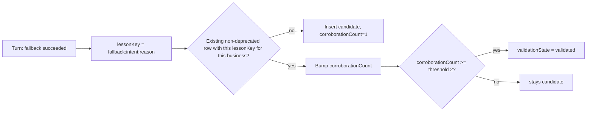

# Experience memory / recall

## The slot this fills

Before this change, Soko's type system, telemetry vocabulary, and prompt-assembly wiring for a
recall subsystem all already existed and were live:

- `AgentContextSourceType` includes `"recall"` (`packages/shared-types`).
- `contextSourcesForRuntime` already filtered/retained `recall`-type sources by
  `AgentMemoryPolicy.reusableWorkflowMemoryEnabled` and `retentionDays`
  (`services/api/src/cp2/domains/agent-runtime/runtime-context.ts`).
- `assembleAgentInferenceMessage` already rendered a `<relevant_recall>` block, explicitly marked
  advisory and subordinate to authoritative context ("Recall is historical guidance only... always
  override it") (`services/api/src/cp2/agent-business-runtime.ts`).
- `RuntimeTelemetryState` already declared `recall.candidate_generated`, `.candidate_rejected`,
  `.deduplicated`, `.persisted`, `.retrieved`, `.applied`, `.persistence_failed`.
- `context/agent/recall.md` already specified the exact record shape and lifecycle intent
  ("small, validated, shop-scoped lessons distilled after an attempted local inference failed and an
  authorized cloud fallback succeeded... `Trigger` / `Learned behavior` / `Failure avoided`").

**Nothing ever wrote a `recall`-type source, and none of the `recall.*` telemetry states were ever
emitted.** This was the single largest, most clearly-scoped gap found in
[`muse-adoption-audit.md`](muse-adoption-audit.md). This change fills it - it does not redesign any
of the above.

## What `RuntimeExperience` stores

```ts
interface RuntimeExperience {
  id, tenantId, shopId, agentId: string;
  taskType: RuntimeParserIntent;
  situation: string;       // short, deterministic description - never model narration
  lessonKey: string;       // stable dedup/corroboration key
  recipeId, recipeVersion: string | number | null;
  evidenceRefs: string[];  // RetrievedAgentContextItem.sourceId values consulted
  toolSequence: RuntimeToolName[];
  resultType: string;
  verificationResult: string | null;
  outcome: "successful" | "adjusted" | "rejected" | "failed" | "unknown";
  lesson: string;
  validationState: "candidate" | "validated" | "deprecated";
  corroborationCount: number;
  sourceTurnId: string;    // diagnostic only - never used to resume execution
  createdAt, updatedAt: string;
  deprecatedAt: string | null;
}
```

No hidden chain-of-thought, no raw conversation transcript - only structured facts about what
happened, matching the brief's explicit prohibition.

## Extraction trigger (v1): scoped, not speculative

This change extracts exactly one trigger, chosen because it is the one `context/agent/recall.md`
already specified and because it needs no new judgment call about what counts as a "lesson":
**a turn where the primary model failed and an authorized fallback model completed the request
successfully** (`modelRoute.trace.fallbackUsed === true`, `status === "completed"`,
`verification.ok`). `recordFallbackExperience`
(`services/api/src/cp2/domains/agent-runtime/store.ts`) runs at the end of `executeRuntimeTurn`.

Broader triggers (repeated tool-failure patterns, repeated hallucinated-entity rejections) are
plausible future extractions but were deliberately not added in this pass - each needs its own
judgment about what makes a reusable, safe lesson, and speculative extraction triggers are exactly
what the brief's "do not create disconnected placeholders" warns against.

## Corroboration and promotion (the lifecycle)



`nextRuntimeExperienceState` (`services/api/src/cp2/domains/agent-runtime/shared.ts`) is a **pure**
function computing this transition - no Map access, no telemetry side effect - so the corroboration/
promotion decision is unit-tested independent of `Cp2Store` (`tests/muse-adoption-runtime.test.ts`).
The calling store method does the Map lookup/write and emits the telemetry events the pure function
returns (`recall.candidate_generated`, `recall.deduplicated`, `recall.persisted` - finally giving
those long-declared states real emissions).

A `candidate` is **never** surfaced into a prompt - only `validated` experiences are synthesized into
`recall`-type context sources. This is the brief's "one bad execution must not permanently poison
memory" requirement, enforced structurally: a single occurrence can never reach a merchant's prompt.

## Retrieval

`contextSourcesForRuntime` synthesizes one `AgentContextSource` (type `"recall"`) per validated
experience for the business, formatted exactly per `recall.md`'s own convention:

```
Trigger: <situation>
Learned behavior: <lesson>
Failure avoided: an unanswered or failed request.
```

gated on `profile.memoryPolicy.reusableWorkflowMemoryEnabled` (the same policy flag that already
existed for this purpose) and gone through the *same*, unmodified relevance-scoring, budgeting, and
`<relevant_recall>` rendering pipeline every other context source uses.
`confidence = min(1, corroborationCount / 2)` and `provenance.resolver = "model_recall"` - never
mistaken for a canonical record (see [`evidence-graph.md`](evidence-graph.md)).

## Retention

`purgeExpiredRuntimeExperiences` (mirroring `purgeExpiredAgentOwnerCorrections` exactly) deprecates
- never hard-deletes - any experience older than the business's own
`memoryPolicy.retentionDays`, run by a daily background sweep
(`runtime-experience-retention-runner.ts`, wired into `services/api/src/index.ts` next to the
existing owner-correction retention runner, toggleable via
`ENABLE_RUNTIME_EXPERIENCE_RETENTION_RUNNER`).

## Persistence and tenant isolation

Migration `088_runtime_experiences.sql` adds `cp2_runtime_experiences`, the same generic CP2 envelope
shape as `cp2_agent_owner_corrections`, additive, with a CHECK constraint on `validationState`/
`outcome`. Classified `DELETE` in `scripts/purge-all-users.sql` (tenant/account data). Every read path
(`validatedRuntimeExperiencesForBusiness`) filters by `shopId === businessId` before anything is
synthesized into a source - proven by an explicit two-business isolation test in
`tests/muse-adoption-runtime.test.ts` (a validated experience seeded for Business A is confirmed
absent from Business B's retrieval).
