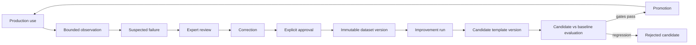

# Model Template expertise flywheel

## Product thesis

Foundation models provide intelligence. `.soko` Model Templates provide expertise. The durable
asset is the domain specification, examples, evaluation evidence, tools, corrections, and lineage.
A base model is a swappable execution dependency.

## Components

```text
Chat/UI
  -> tenant-scoped Model Template APIs
  -> existing AgentRuntimeDomain and tool harness
  -> promoted .soko template version
  -> source expertise + optional compiled expertise
  -> existing native runtime binding
  -> compatible base model
  -> existing execution host / ModelRuntimeAdapter
```

`ModelTemplatesDomain` owns templates, versions, suites, observations, corrections, datasets,
improvement runs, report cards, promotions, exports, and rollback. It is composed into `Cp2Store`
and persisted by the existing Postgres snapshot queue. It is not a standalone service.

## Recursive lifecycle



Production output and user behavior never become truth automatically. A correction is eligible for
training only after an authorized actor approves it. Dataset versions freeze content and record a
SHA-256.

## Supported optimization

`PROMPT_OPTIMIZATION` is implemented. It deterministically compacts source instructions, merges
approved training corrections into traceable source rules, writes a base-neutral prompt artifact,
and creates a candidate semantic version. `CONTEXT_GISTING`, `DATASET_DISTILLATION`,
`ADAPTER_TRAINING`, `FULL_FINE_TUNE`, and `QUANTIZATION` are declared extension points and return
`IMPROVEMENT_STRATEGY_UNSUPPORTED` until a real worker exists.

## Runtime integration

For a normal authenticated runtime turn, Soko first resolves the existing agent, native runtime
binding, model, and host. It then looks up the promoted template for that business and agent and
checks the actually selected model against template requirements. Compiled instructions join the
existing `ShopAgentRuntime` policy before `assembleAgentInferenceMessage`. Tool authorization and
output parsing are unchanged.

This order preserves user model overrides and native fallback. An incompatible override fails
explicitly instead of running without the expert.

## Data flow and persistence

Migration 081 adds relationally linked normalized tables. Every tenant-owned record contains
business and account scope. Flexible manifests, fixtures, evaluator details, and metrics live in
JSONB `record`; parent relationships and important status/checksum constraints remain relational.
Large compiled artifacts use object-storage pointers and hashes, not Postgres model binaries.

## Observability

Lifecycle events use `template.created`, `template.version_created`, `evaluation.*`,
`correction.*`, `dataset.version_created`, `improvement.*`, `template.promoted`, and
`template.rolled_back`. Payloads contain IDs, state, counts, strategy, and aggregate measurements,
not raw observations, prompts, examples, secrets, or conversations.

## Marketplace implication

Marketplace can eventually display the same report-card API: demonstrated task score, evaluation
count, prompt reduction, tested bases, current version, and verified provenance. Parameters and
provider branding are secondary metadata. No Marketplace redesign is required for the runtime
lifecycle.
