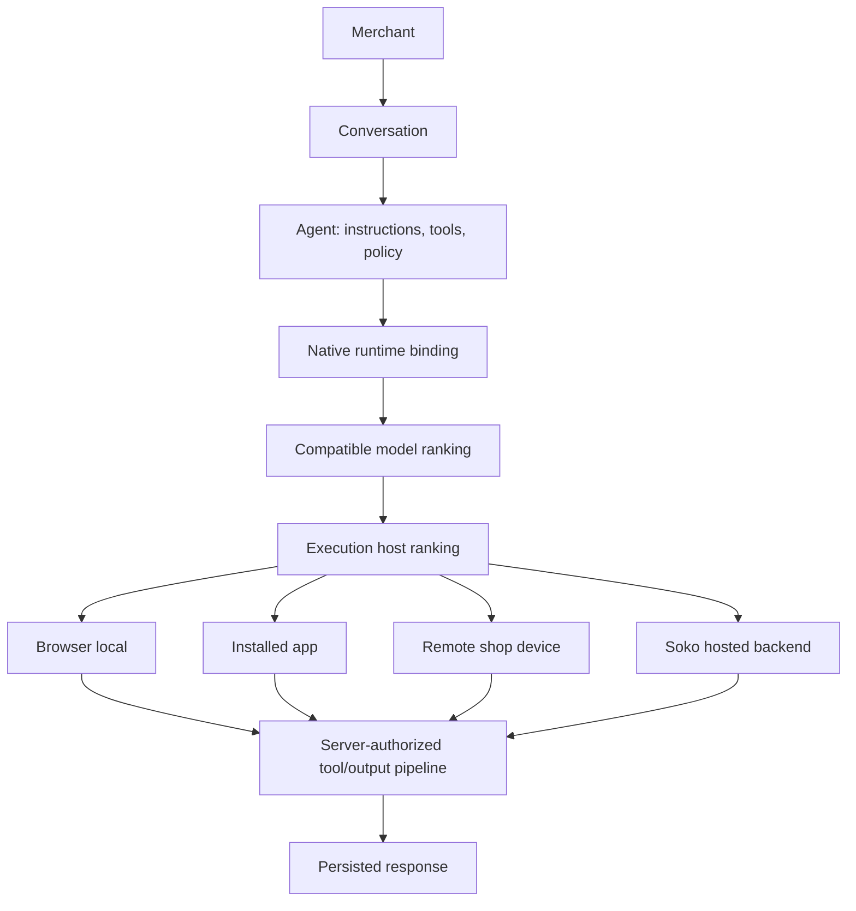

# Native agent/model runtime

Soko AI is zero-setup for an eligible signed-in shop when at least one server-reachable inference
adapter is configured. A merchant can open chat and send a first message without installing an
agent, downloading a model, or activating a binding. Browser, installed-app, and shop-device
execution remain optional optimizations.

## Runtime graph

The durable graph lives in `cp2_native_runtime_agents`, `cp2_native_runtime_models`,
`cp2_native_execution_hosts`, `cp2_native_model_installations`,
`cp2_native_runtime_bindings`, and `cp2_native_runtime_binding_models`. A conversation references
the binding, not a permanently fixed model. `NativeRuntimeBindingStore` is the in-process graph
authority and `resolveNativeRuntimeModelProvider` is the adapter boundary.

An **agent** owns instructions, capabilities, tools, and business behavior. A **model** is an
independently swappable inference artifact or service model. A **runtime binding** stores the
relationship, preference, ordered fallbacks, and execution policy. An **execution host** is an
authorized location that can run an installed/available model. An **inference adapter** hides the
engine or vendor implementation behind `ModelRuntimeAdapter`. A **conversation** retains the
binding while the selected model and host may change on each attempt.

## First-chat provisioning

`AgentRuntimeDomain.ensureDefaultRuntimeForTurn` runs inside the authenticated chat path:

1. Preserve an already resolvable or explicitly active shop binding.
2. Rank the profile preference, shop preference, repository default, and compatible catalog
   models without branching on provider identity.
3. Consider only server-reachable targets for a server request. Browser and installed-app targets
   are eligible only through the current-device client protocol.
4. Ask each generic adapter whether it can run the model.
5. Pass verified candidates to `NativeRuntimeBindingStore.ensureDefaultRuntimeBinding`.
6. Upsert a deterministic shop/account/agent binding, scoped hosts, installations, a primary, and
   an optional fallback; then attach the conversation.
7. Resolve and execute normally.

The operation is safe to call repeatedly. Binding, host, installation, and role IDs derive from
their scope and identities. Migration 070 adds one active tenant-default constraint, so concurrent
first chats converge. No unavailable adapter is persisted as a healthy host.

Lazy provisioning is also the existing-user migration strategy. Existing active bindings are
preserved. Users with no usable native graph are normalized on their next chat; stale activation
flags do not create the default. Explicit `LOCAL_ONLY` remains strict.

## Resolution and fallback

Model compatibility uses the agent runtime-contract version and required model capabilities.
Within a binding, the primary precedes fallbacks by persisted priority. A role is eligible only
when its model is active, its installation is usable, its host is usable, and global/account/shop
scope authorization succeeds.

For a fresh browser request, server provisioning considers `backend`; it never pretends a browser
model or installed bridge is available. A configured local client prefers its current local route.
If that route cannot execute, chat falls back to the server unless the merchant explicitly chose
`LOCAL_ONLY`.

Each server attempt records a key made from model, host, and execution target. Timeout,
unreachable-engine, loading/unavailable-model, rate-limit, and provider-operation failures may try
the next candidate. Authentication, invalid tool calls, malformed model output, aborted requests,
and unknown failures are not retried. Attempted keys prevent loops. The runtime trace records the
binding, resolved model, host, target, resolution source, fallback index/reason, duration, and
result without logging prompts or credentials.

## Execution targets

| Target               | Location and trust                                        | Availability                                                               | Fallback                          |
| -------------------- | --------------------------------------------------------- | -------------------------------------------------------------------------- | --------------------------------- |
| `backend`            | Soko/server-reachable inference through a generic adapter | Adapter `canRun` plus execution result                                     | Next compatible binding candidate |
| `browser-local`      | Current authenticated browser only                        | Cached model and ready browser runtime in the current session              | Backend unless `LOCAL_ONLY`       |
| `installed-app`      | Trusted `window.SokoAgentModelRuntime` bridge             | Bridge, ready assignment, matching model/runtime, and authenticated device | Backend unless `LOCAL_ONLY`       |
| `remote-shop-device` | Authorized same-tenant owner/shop device                  | Existing owner-node presence/heartbeat and model support                   | Next client route or backend      |

Provider names are not execution targets. `backend` can be implemented by the private inference
service or an optional provider adapter; changing that implementation does not change agents,
conversations, bindings, models, hosts, or API target contracts.

## Security and tools

The API derives account and shop identity from the authenticated session. Requested binding scope
is checked during conversation assignment, and host scope is checked again during resolution.
Tenant hosts use business-scoped deterministic IDs; one shop cannot reuse another shop's host.
Client completions remain untrusted until their ready device assignment is verified. All tool
parsing, permissions, confirmation, execution, and auditing stay server-controlled regardless of
where inference ran.

Remote/local runtimes receive only request context required for inference and never receive server
credentials. Offline chat works only when a compatible local runtime is ready; otherwise the UI
reports AI execution unavailable without claiming full offline support.

## Model preferences

“Use with agent” and model activation are preference/verification operations. They may replace the
binding primary without replacing the conversation or agent. If the preferred model cannot run,
automatic policy selects a fallback. Removing a preference returns execution to automatic mode;
it does not disable ordinary chat.
