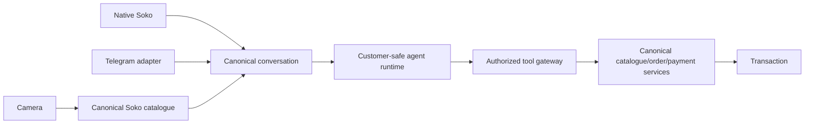
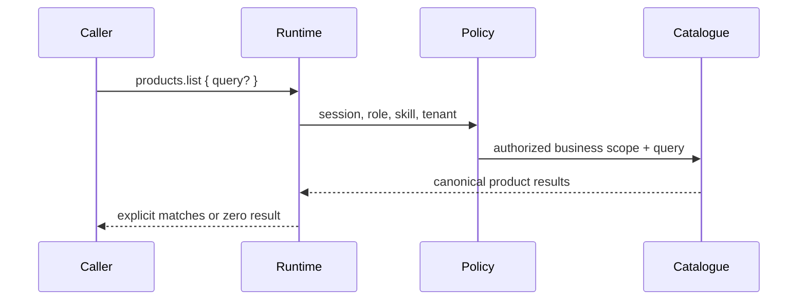

# Platform-agnostic chat commerce

## Target architecture

Soko owns catalogue, inventory, price, business identity, authorization, conversations, orders,
payments, and customer relationship state. External providers are replaceable transports.



The repository is **ready with small, transport-specific gaps** for the provider-adapter portion.
The native customer principal, canonical message/order paths, product media/camera publication,
and provider-neutral persistence are implemented. Telegram webhook validation, deep-link grants,
rendering/sending, and live bot verification remain adapter work. See
`platform-agnostic-chat-commerce-audit.md` for the baseline evidence and remediation record.

## Catalogue query flow



Matching is lexical and deterministic: normalized exact name/SKU, token prefix/containment, then a
bounded edit-similarity fallback. No embeddings, vector database, translation model, generated
price, or generated availability is used. Results always contain canonical product IDs and values
from the target business.

Seller-managed aliases are stored on the canonical product (`products.aliases`), so local terms
such as `nyanya` resolve without a model in the query hot path. Aliases are normalized and bounded
at write time. They do not create shadow products.

Two existing gateway surfaces delegate to the same service:

- Runtime: `products.list` with optional `{ query }`. Omitting `query` preserves the existing full
  seller catalogue list behavior.
- MCP: `soko.query_catalogue` with `{ shopId, query, limit? }`, available to `mcp:read` principals.
  A shop-bound token cannot query another shop even when its caller supplies another `shopId`.

The structured result uses `CatalogueQueryResult` / `CatalogueProductSummary`. It contains selling
price but never buying cost, and maps inventory to `available` / `unavailable` without inventing
stock. Product image is the published `ProductMediaSummary.publicUrl`, or `null` when the seller has
not retained a canonical image.

## Customer-safe commerce principal

`POST /public/storefronts/:agentId/sessions` creates or resolves a business-scoped Soko platform
identity and canonical storefront conversation. It returns an opaque, expiring capability token;
only the SHA-256 token hash is persisted. The capability is bound to one business, conversation,
and external identity and cannot cross shops.

Customer catalogue requests execute only the existing low-risk `products.list` action. Runtime
sessions and turns are still recorded, but the principal has `view_only` context and no merchant
membership, private business context, or write-capable tool path. Text responses and product cards
are both canonical conversation messages.

Public orders revalidate the same canonical product IDs, availability, quantity, and selling price,
then create a canonical draft invoice. Their returned payment state is derived from the existing
invoice/payment service, initially `unpaid`; the request metadata links the conversation and
invoice rather than acting as a second transaction ledger.

## Camera-to-catalogue lifecycle

```text
UPLOADED -> QUEUED -> VALIDATING -> PREPROCESSING -> EXTRACTION_RUNNING
-> FIELDS_EXTRACTED -> DUPLICATE_CHECK -> REVIEW_REQUIRED
-> CONFIRMED -> PUBLISHED
```

Failures transition to `EXTRACTION_FAILED` and may be retried to `QUEUED`, entered manually, or
cancelled. Machine extraction is never a live product. Price is null unless visibly extracted with
sufficient confidence, and still requires seller confirmation. Temporary input media follows OCR
cleanup policy; it becomes product media only after an explicit seller choice.

This lifecycle is implemented by the product-capture routes and persisted
`ProductCaptureJobSummary` records. Uploads reuse the receipt binary validation/scanning and OCR
bridge. Extracted fields retain source and confidence; missing prices remain null. Failed captures
can retry or enter seller-supplied fields. Cancellation and publication-without-media delete the
temporary media record. An explicit `keepImageAsProductMedia` review choice promotes the upload to
canonical product media only after confirmation.

## Provider-neutral channel model

The channel foundation represents:

- a canonical conversation;
- a business-scoped provider conversation mapping;
- a provider identity separate from a Soko account identity;
- a durable provider update receipt for idempotency;
- an outbound delivery attempt rendered at the adapter boundary.

`PlatformIdentitySummary`, `ConversationChannelSummary`, and `ProviderUpdateReceiptSummary` are
persisted independently of transport code. Inbound provider messages normalize into canonical
conversation messages. Duplicate `(provider, external_update_id)` values return the original
receipt/message. Outbound messages can select a configured provider channel and enter normal
delivery-attempt state; until an adapter is installed they remain queued with
`provider_adapter_unconfigured`.

The provider identity has a nullable Soko account link and provider onboarding leaves it null.
Display name, username, Telegram user ID, or provider-claimed phone number never creates that link.

## Telegram shared-bot model (gated target)

Seller entry links will use an opaque, server-issued, expiring/revocable grant rather than a raw
business UUID. A valid `/start` consumes or resolves the grant once, stores the business/channel
relationship, and subsequent updates use that stored relationship. A chat with no valid relationship
is not assigned to any business.

Inbound updates must validate Telegram's webhook secret, durably deduplicate `(provider,
external_update_id)`, normalize into canonical messages, and call the same customer runtime as
native Soko. Outbound rendering resolves the conversation channel and converts canonical text or
product cards into Telegram-supported media, text, and inline actions. Provider outages update
delivery state but never block native commerce.

## Tenancy and failure isolation

All catalogue, channel, identity, and update lookups are resolved with an authoritative business
relationship. External IDs and deep-link payloads are locators, never authorization by themselves.
Telegram configuration remains optional for native startup; once a deployment enables Telegram,
missing required secrets must fail that adapter closed.

## Configuration and verification

No Telegram environment variables are added until its adapter exists. Catalogue, customer-runtime,
camera publication, provider mapping, update deduplication, and queued outbound behavior are
automatically verified locally. There has been no real Telegram bot, webhook, update, backend
processing, or outbound response exercise, so this work makes no live Telegram claim.

Future provider extensions implement the same normalization/rendering interface and add only their
transport-specific validation and rendering. They must not introduce provider-specific products,
orders, payments, agent context, or authorization.
