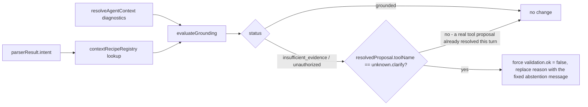

# Runtime grounding gate

## The problem this closes

Soko's runtime already grounds most read-oriented tasks by construction: a recognized intent like
`show_products`/`check_debt` deterministically resolves to a tool proposal
(`createRuntimeToolProposal`, `packages/tool-core`) that executes against live data
(`products.list`, `payments.debtors`, ...) - the tool's result *is* the evidence, independent of
whether `retrieveAgentContext` found matching text. That existing design was discovered, not assumed,
during this change: an early version of the grounding gate blocked *every* turn pre-emptively when
retrieval looked thin, and broke exactly this path (a real regression caught by the existing test
suite - see the commit history for `agent-business-runtime.ts`/`store.ts` in this change). The gate
was narrowed to the one place a real gap exists instead.

## The real gap

`parseRuntimeModelOutput` (`packages/tool-core/src/parsers/model-output.ts`) supports a `"response"`
output kind: the model answers in free text instead of proposing a tool. That maps to
`{ toolName: "unknown.clarify", validation: valid(), reason: <the model's own text> }` -
and `createRuntimeResponse` (`services/api/src/cp2/domains/agent-runtime/shared.ts`) falls through to
returning that text verbatim for any unmatched tool name. **That free text is model output, not
evidence.** For a task whose recipe requires evidence, letting it reach the merchant unchecked is
exactly the failure mode the brief's grounding-gate requirement describes.

## Where it's wired

In `executeRuntimeTurn` (`services/api/src/cp2/domains/agent-runtime/store.ts`):

1. `grounding = evaluateGrounding({ recipe: contextRecipeRegistry[parserResult.intent], retrievedContext, diagnostics })`
   runs right after context resolution, for every turn, and is always recorded as a
   `grounding.accepted`/`grounding.rejected` telemetry event (brief §18's named observability
   events) - whether or not it ends up changing anything.
2. After the turn's `proposal` is resolved (hashtag/document-import/messaging/network/commerce/
   context-script/model/parser-fallback, in that existing precedence order), **only** when
   `proposal.toolName === "unknown.clarify"` and `grounding.status !== "grounded"` does the gate
   override `proposal.validation` to `{ ok: false, errors: [groundingAbstentionMessage(grounding)] }`.
3. That forces the existing `clarification_required` plan path (turn status `"clarifying"`, or
   `"blocked"` for `unauthorized`) - no new status, no new execution path, no change to how a real
   tool proposal is authorized or executed.

## Why this order is safe

- A deterministic parser/context-script proposal is never touched - it isn't `unknown.clarify`.
- A model-proposed *tool* call is never touched - same reason, and it separately passes through
  `findRuntimeUnknownEntityReferenceError`/`validateRuntimeToolInput`/`enforceAgentPolicy` regardless.
- Only the one case where nothing else resolved the turn into an executable action, and the model
  filled that gap with unverified prose, is intercepted.
- The abstention message (`groundingAbstentionMessage`, `agent-business-runtime.ts`) is a fixed
  template keyed only by the grounding decision's own data (missing domain names) - never model
  text, never fabricated.

## Test coverage

`tests/muse-adoption-runtime.test.ts` covers all four `GroundingDecision` branches as pure-function
unit tests, and one HTTP-level integration test that reproduces the exact shape of bug the narrowing
above was built to avoid: a business with a real customer record, queried in a way that retrieves
nothing, correctly overrides a fabricating model's answer - while the same query against a business
with *no* customers at all (a legitimately empty result) is left untouched.
