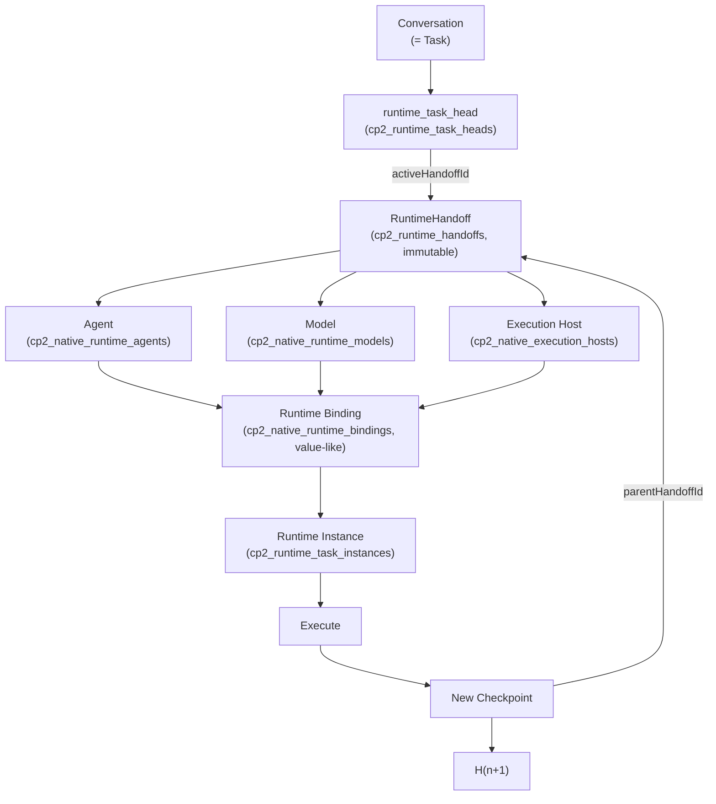
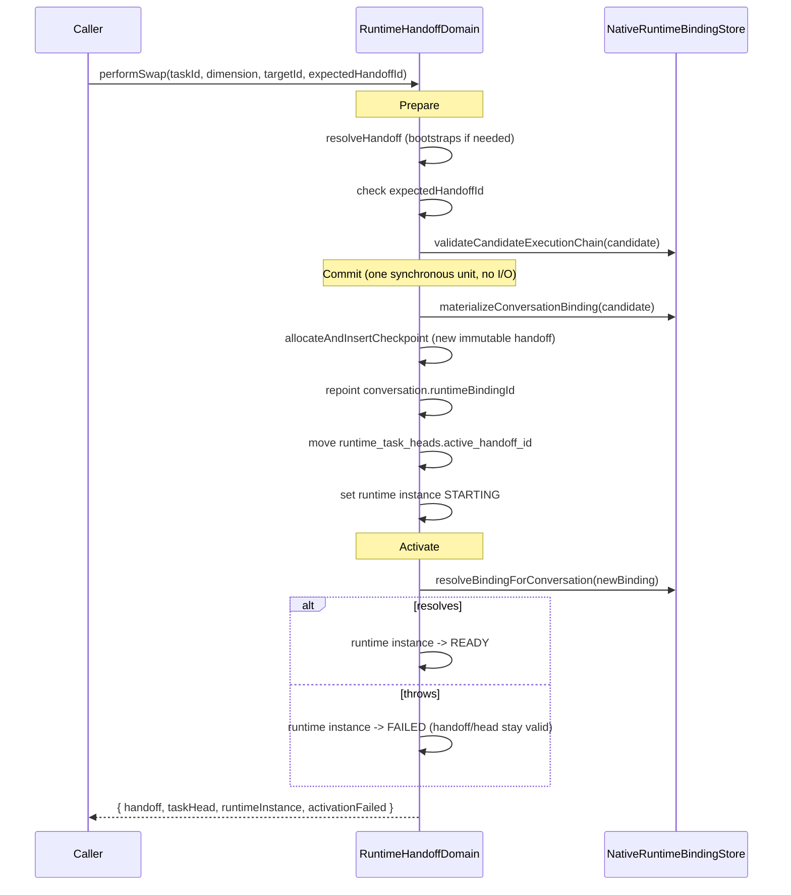

# Runtime Handoff Protocol

Soko's native runtime graph (`063_native_runtime_bindings.sql` onward, see
[native-runtime-bindings.md](./native-runtime-bindings.md)) resolves *which* agent, model, and
execution host a conversation uses. Until this protocol, it had no way to represent a task's
in-flight execution state independently of that binding, so swapping the agent, model, or host had
no portable checkpoint for the new runtime to resume from.

The core principle:

> Never move execution state by moving chat transcripts. Move an immutable checkpoint and repoint
> execution to it.

A `RuntimeHandoff` is that checkpoint. It is independent of conversation transcript, agent
implementation, model implementation, execution host, provider, and runtime process - Soko's
runtime can swap any of those without losing task continuity.

## How this repository's model differs from the reference design

This protocol was specified against a generic multi-tenant agent runtime (`tasks`,
`runtime_instances`, plain `agents`/`models`/`execution_hosts` tables, per-request Postgres
transactions). Soko is architecturally different in three ways that shaped every decision below:

1. **No separate `tasks` entity.** A conversation is Soko's unit of runtime execution (see
   `NativeRuntimeBindingStore.resolveRuntimeBinding` - a conversation carries `runtimeBindingId`
   directly). So `taskId` is populated with the owning conversation's id everywhere in this
   protocol. The field stays named `taskId` rather than `conversationId` so a future split of
   "task" from "conversation" (multiple concurrent tasks per conversation) only has to add a real
   `tasks` table, not rename this protocol's vocabulary.
2. **Different reference entities.** "Agent", "model", and "execution host" here are
   `cp2_native_runtime_agents`, `cp2_native_runtime_models`, and `cp2_native_execution_hosts` -
   Soko's actual native runtime graph, not a generic schema. There is no `runtime_instances`
   table; the closest analog (a per-task "currently executing process" pointer) did not exist and
   is added by this protocol as `cp2_runtime_task_instances` (see below) - `cp2_runtime_sessions`
   is a different, business/user-scoped agentic-planner concept and is deliberately left alone
   rather than overloaded with an unrelated meaning.
3. **In-memory, synchronous domain model.** Every CP2 domain in this codebase (including this one,
   `RuntimeHandoffDomain`) is an in-memory store of JS Maps, mutated synchronously by Fastify
   request handlers, and persisted to Postgres via a full-collection snapshot writer under an
   advisory lock (`postgres-store.ts`), replicated across API instances via `LISTEN`/`NOTIFY`. This
   is not a per-request-transaction architecture, so "atomic version allocation" and "optimistic
   concurrency" are implemented differently than a classic `SELECT ... FOR UPDATE` design - see
   [Concurrency model](#concurrency-model) below.

Everything else in this document assumes those three adaptations without restating them.

## Architecture



- **A handoff represents task state** - goal, current state, completed/pending actions,
  decisions, rejected paths, test results, and the `next_action` a resumed runtime should take.
- **A binding represents the selected executor configuration** - which agent, model, and host a
  conversation currently uses to run its *next* turn.
- **A runtime instance represents the process currently believed to be executing** that
  configuration, and its own health, independent of whether the checkpoint/binding are valid.

These three concerns are never collapsed into one record (invariant 1.4).

## Immutable checkpoints (invariant 1.1)

`cp2_runtime_handoffs` rows are never updated after insertion. The domain layer (
`RuntimeHandoffDomain`) only ever inserts new handoffs; it never mutates an existing one. As
defense in depth, migration `083_runtime_handoff_protocol.sql` adds a Postgres trigger that raises
on any `UPDATE` that would change a row's `record` content - it tolerates a byte-identical
re-upsert (this repository's snapshot writer unconditionally `INSERT ... ON CONFLICT DO UPDATE`s
every in-memory row on every flush) but rejects an actual change.

Whether a handoff is authoritative is never stored on the handoff itself. That is
`runtime_task_heads.active_handoff_id`'s job (invariant 1.2) - a dedicated, mutable pointer, one
row per task, plus a `next_checkpoint_version` counter used for atomic version allocation.

```typescript
interface RuntimeHandoff {
  id: string;
  taskId: string; // = conversation id, see above
  conversationId: string;
  parentHandoffId: string | null; // causal ancestry, see Offline causal ancestry below
  goal: string;
  currentState: string;
  completedActions: RuntimeAction[];
  decisions: RuntimeDecision[];
  rejectedPaths: RuntimeRejectedPath[];
  pendingActions: RuntimeAction[];
  nextAction: string | null;
  relevantContext: RuntimeContextReference[]; // references, never copies - see Recall below
  artifacts: RuntimeArtifactReference[];
  tests: { passed: string[]; failed: string[]; pending: string[] };
  runtime: { agentId: string; modelId: string; executionHostId: string };
  checkpointVersion: number | null; // cloud-authoritative ordering; null until synced
  schemaVersion: number;
  createdAt: string;
}
```

Full type definitions live in `packages/shared-types/src/runtime-handoff.ts`.

## Concurrency model

The reference design assumes per-request Postgres transactions with `SELECT ... FOR UPDATE` row
locks. Soko's actual execution model is different (see above), so the shared version-allocation
primitive the protocol requires (section 6.1: "one shared locking implementation used by both
checkpoint promotion and swap commit") is implemented as **one private synchronous method**,
`RuntimeHandoffDomain.allocateAndInsertCheckpoint`, called by both `createCheckpoint` (with
`promote: true`) and `performSwap`'s commit step.

Why a plain synchronous method is enough: every `RuntimeHandoffDomain` method runs to completion
without an `await` between reading `runtime_task_heads` and writing the next checkpoint + head.
Node's single-threaded event loop guarantees no other call on the same process can interleave in
the middle of that read-then-write - there is no window for two calls on the same process to race.
This is the same reasoning every other CP2 domain in this codebase already relies on (none of them
use in-process locks either).

The remaining risk is **cross-process**: this repository already runs multiple API instances
behind Postgres `LISTEN`/`NOTIFY` snapshot sync (`cp2/postgres-store.ts`). Two instances could each
independently compute the "next" version for the same task. The
`cp2_runtime_handoffs_task_version_idx` unique partial index on `(task_id, checkpoint_version)` is
the last-resort arbiter for that case, exactly like every other CP2 table's consistency model in
this codebase (there is no cross-instance real-time lock anywhere in this repository; eventual
consistency via snapshot replication is the norm).

**Optimistic concurrency** (section 7) is the primary defense against lost updates and is checked
in-process: every mutation that moves the head (`promote: true` checkpoints, swaps, rollback)
requires `expectedHandoffId`, compared against the current `runtime_task_heads.active_handoff_id`
before any write happens. A mismatch throws `409 RUNTIME_HANDOFF_CONFLICT` and changes nothing.

## Checkpoint creation

`POST /v1/runtime/:taskId/checkpoints` (see [REST API](#rest-api) for why the path differs from
the reference `/runtime/...`).

1. Resolve the task (bootstrapping a legacy handoff if none exists yet - see
   [Migration and legacy tasks](#migration-and-legacy-tasks)).
2. Resolve the current task head.
3. Merge the caller's provided fields over the previous handoff's fields (anything omitted is
   carried forward unchanged - a checkpoint is a snapshot of *current* state, not a diff).
4. Insert a new immutable `RuntimeHandoff` with `parentHandoffId` set to the current head.
5. Allocate the next `checkpointVersion` atomically (see [Concurrency model](#concurrency-model)).
6. Optionally move the task head, only when the caller passed `promote: true` **and** a matching
   `expectedHandoffId`.
7. The checkpoint's `runtime` field (agent/model/host) is always carried forward unchanged - only
   `performSwap` changes it.

### Idempotency

No generic idempotency-key primitive existed in this codebase before this protocol (the closest
prior art, `device-bootstrap`'s key-hash map, is single-purpose). This protocol adds one:
`cp2_runtime_operation_dedup`, a dedup table keyed by `(operationType, idempotencyKey)`, checked
before a checkpoint/swap/rollback mutation runs and written atomically with it (again, "atomically"
in the same synchronous-call sense as above - no interleaving is possible between the dedup check
and the dedup write). Retrying the same request with the same `Idempotency-Key` header returns the
original result; it never produces a second checkpoint.

## Swap: agent, model, host

```
POST /v1/runtime/:taskId/swaps/agent
POST /v1/runtime/:taskId/swaps/model
POST /v1/runtime/:taskId/swaps/host
```

All three funnel into one internal operation, `RuntimeHandoffDomain.performSwap({ taskId,
dimension, targetId, expectedHandoffId, idempotencyKey })`, run as **Prepare -> Commit -> Activate**:



**Prepare** is read-only: resolve the current binding/head, validate `expectedHandoffId`, and
validate the candidate (agent, model, host) triple. A failure here (incompatible candidate, stale
head) leaves the old runtime fully authoritative - nothing has changed yet.

**Commit** is one small synchronous block: no HTTP calls, no provider calls, no inference. It
creates or reuses a value-like binding for the new triple (never mutates an existing binding - see
[Binding cardinality](#binding-cardinality) below), inserts the new immutable checkpoint, repoints
the conversation's `runtimeBindingId`, moves the task head, and marks the runtime instance
`STARTING`.

**Activate** happens after commit: it resolves the new binding via
`NativeRuntimeBindingStore.resolveBindingForConversation` to confirm the chain is actually usable
right now, and sets the runtime instance to `READY` or `FAILED` accordingly. A failure here **never
undoes the commit** - see [Runtime activation failure](#runtime-activation-failure).

### Compatibility validation

`performSwap`'s Prepare phase (and `materializeConversationBinding`'s Commit-phase validation) call
`NativeRuntimeBindingStore.validateCandidateExecutionChain`, added to that store rather than
duplicated: it reuses the exact same contract-version, capability-match, and
installation/host-availability checks turn-time resolution already enforces (see
[native-runtime-bindings.md](./native-runtime-bindings.md) "Availability and compatibility"). There
is exactly one compatibility system in this codebase, not two.

### Binding cardinality

`cp2_native_runtime_bindings` rows are shared/reusable - one binding can be referenced by many
conversations (the global default binding, or a business-wide binding chosen via "Use with
agent"). Mutating a shared binding in place to perform a swap would silently change *every*
conversation that references it, which invariant 1.3/section 9 forbid.

`NativeRuntimeBindingStore.materializeConversationBinding` therefore treats bindings as
value-like objects: it derives a deterministic id from `(accountId, businessId, agentId, modelId,
executionHostId)` (the same `stableUuid` technique this store already uses for binding roles), and
either creates a new binding for that exact tuple or reuses an existing one with byte-identical
content - it never mutates an existing binding's fields. Only the swapped conversation's
`runtimeBindingId` is repointed; every other conversation referencing the old binding is
untouched (`tests/runtime-handoff-domain-unit.test.ts` "never mutates a shared runtime binding in
place when swapping" asserts this directly).

## Runtime activation failure

Runtime health is represented independently of task state (section 12,
`RuntimeTaskInstance.status`: `STARTING | READY | RUNNING | DEGRADED | FAILED | STOPPED`). A DB
commit succeeding but the Activate phase failing is a valid, expected state:

```
task head:        H38          (valid)
binding:           Pi + Qwen    (valid)
runtime instance:  FAILED
```

`H38` is not invalidated by a failed activation. The task history is never rolled back
automatically; recovery (retry the same runtime, pick a different compatible host/model, or leave
task state untouched entirely) is a separate, later decision. See
`tests/runtime-handoff-domain-unit.test.ts` "represents runtime activation failure independently of
task/checkpoint state" for the test that pins this behavior with a runtime whose Activate-phase
resolution is made to fail deliberately while its Commit phase still succeeds.

## Rollback

`POST /v1/runtime/:taskId/rollback` moves `runtime_task_heads.active_handoff_id` to an earlier
immutable checkpoint. It does **not**:

- mutate the target or any intermediate handoff row,
- rewrite checkpoint history,
- revert the selected agent/model/host binding.

If both binding and state need reverting, compose a swap with a rollback as two separate calls -
the protocol deliberately does not add a combined "undo everything" endpoint (section 14).

## Resume

`POST /v1/runtime/:taskId/resume` resolves the authoritative task head, resolves the current
binding, sets the runtime instance's `activeHandoffId` and status to `RUNNING`, and returns
`nextAction` from the handoff. It never reconstructs state from the conversation transcript unless
the task predates this protocol (see below) - the handoff is the only source of truth for "what was
I doing."

## Migration and legacy tasks

Existing conversations have no handoff. The first time `resolveHandoff` (called by every other
operation) is invoked for such a task, `RuntimeHandoffDomain.bootstrapLegacyHandoff` derives an
initial handoff from the conversation's *current* runtime binding (resolved via
`NativeRuntimeBindingStore.resolveBindingForConversation`, falling back to the provider-neutral
global default binding when the conversation has no explicit one), inserts it as checkpoint version
1, and creates the task head pointing at it. No destructive migration of historical conversations
is required; existing users keep working. If the conversation's current binding cannot resolve to
an available model (e.g. a business deactivated its only model), bootstrap fails with
`503 RUNTIME_LEGACY_BOOTSTRAP_UNAVAILABLE` rather than fabricating a broken handoff.

## Runtime drift detection

`resolveHandoff` (section 5) compares `runtime_task_instances.active_handoff_id` for a task against
`runtime_task_heads.active_handoff_id` for the same task:

```
isRuntimeStale = runtimeInstance !== null
              && runtimeInstance.activeHandoffId !== taskHead.activeHandoffId
```

Example: task head is `H42` (a checkpoint was created and promoted, or a rollback happened) but the
runtime instance still believes it is running `H40` - `isRuntimeStale` is `true`. This is the
"backend runtime is stale" signal the protocol calls for.

## Recall vs conversation vs handoff (invariant 1.4/section 19)

- **Conversation** - human + agent messages (`cp2_conversation_messages`). Never embedded in a
  handoff.
- **Recall** - durable learned/user/business knowledge. Out of scope for this protocol; a handoff
  may *reference* it via `relevantContext` (kind `"recall"`, carrying a `refId`), never duplicate
  it.
- **Runtime handoff** - in-flight task execution state, exactly the fields listed above. No
  message content, no full recall dumps.
- **Runtime binding** - current agent + model + execution host selection
  (`cp2_native_runtime_bindings`).
- **Runtime instance** - the process/executor currently believed to be running that binding
  (`cp2_runtime_task_instances`).

These stay five separate concerns/tables. Nothing in this protocol collapses them.

## Offline causal ancestry

Full offline merge is out of scope for this implementation (non-goal, per the protocol's own
scope), but the schema preserves what it needs for later:

- `id` is a globally unique application-generated id (`node:crypto randomUUID`), never reused.
- `parentHandoffId` carries causal ancestry independent of `checkpointVersion`.
- `checkpointVersion` is nullable and cloud-authoritative only - assigned when a checkpoint
  synchronizes with the server, not at creation time.

This is enough to support a future offline branch-then-merge model (`H41 -> H42-A` and
`H41 -> H42-B` concurrently while offline, later merged into `H43`) without a schema migration:
only the merge logic itself is future work.

## REST API

```
GET  /v1/runtime/:taskId
GET  /v1/runtime/:taskId/handoff
GET  /v1/runtime/:taskId/handoff?version=42
GET  /v1/runtime/:taskId/handoffs/:handoffId

POST /v1/runtime/:taskId/checkpoints

POST /v1/runtime/:taskId/swaps/agent
POST /v1/runtime/:taskId/swaps/model
POST /v1/runtime/:taskId/swaps/host

POST /v1/runtime/:taskId/resume
POST /v1/runtime/:taskId/rollback
```

Namespaced under `/v1/runtime/...` (the reference design's paths are bare `/runtime/...`) to match
every other endpoint in this codebase, which lives under `/v1/...`. Mutation endpoints accept an
`Idempotency-Key` header and an `expectedHandoffId` body field. `:taskId` is a conversation id.
Implemented in `services/api/src/cp2/domains/runtime-handoff/routes.ts`; registered in
`services/api/src/cp2/routes.ts`.

## MCP API

`services/api/src/mcp/routes.ts` exposes `soko.runtime_status` (scope `mcp:read`), and
`soko.runtime_checkpoint`, `soko.runtime_resume`, `soko.runtime_rollback`, `soko.agent_swap`,
`soko.model_swap`, `soko.execution_host_swap` (scope `mcp:act`) - the repository's `soko.` naming
convention applied to the protocol's `runtime.*`/`agent.swap`/`model.swap`/`execution_host.swap`
tool names.

MCP tools are authenticated by bearer token + scope, not a browser session cookie, so they cannot
call `RuntimeHandoffDomain`'s session-shaped methods directly the way REST routes do. Rather than
widen the domain's public API to understand two different actor shapes,
`Cp2Store`'s constructor wires `RuntimeHandoffDomain`'s `requireAnySession` dependency to
recognize one reserved, server-internal sessionId shape (`mcp-trusted-account:<accountId>`,
`store.ts`'s `mcpTrustedSessionIdPrefix`) produced only by `Cp2Store`'s own `*ForMcp` methods after
verifying the bearer principal via the same `requireIntegrationPrincipal` check every other MCP
tool uses. The domain itself still only ever sees an opaque sessionId string and trusts the
`requireAnySession` closure's verdict - exactly as it does for a real cookie session. No swap
orchestration, transaction, version-allocation, or compatibility-validation logic is duplicated for
MCP; `Cp2Store.performRuntimeSwapForMcp` and `Cp2Store.performRuntimeSwap` (used by REST) both call
`RuntimeHandoffDomain.performSwap`.

## Non-goals carried over from the reference design

This implementation does not: build a Kanban board or orchestration service; introduce a new
database or vector store; hard-code a specific model provider; couple handoff semantics to any
specific agent/model implementation; duplicate runtime routing; store full conversation transcripts
inside handoffs; turn recall into task checkpoint storage; implement three independent swap
engines (there is exactly one, `performSwap`, parameterized by `dimension`); mutate historical
handoffs; or use chat history as the handoff protocol.

## Tests

- `tests/runtime-handoff-domain-unit.test.ts` - `RuntimeHandoffDomain` exercised directly against a
  hand-built deps object: legacy bootstrap, immutable/parent-linked checkpoints, optimistic
  concurrency (missing and stale `expectedHandoffId`), model/agent swap end-to-end, shared-binding
  non-mutation, Prepare-phase failure leaving the old runtime authoritative, activation failure
  independent of task/checkpoint validity, drift detection, rollback without mutating history,
  idempotent swap/checkpoint retries, and a "two concurrent conflicting swaps" scenario proving
  exactly one winner and one `409`, with no lost update.
- `tests/runtime-handoff-protocol.test.ts` - the REST surface end-to-end through the real Fastify
  app (bootstrap -> checkpoint -> swap -> resume -> rollback -> handoff lookup by id/version),
  idempotent checkpoint retries via the `Idempotency-Key` header, cross-account authorization
  (403/404), and one MCP round trip (`soko.runtime_status` + `soko.model_swap`) proving the MCP
  tool changes the same conversation the REST surface reads back.
