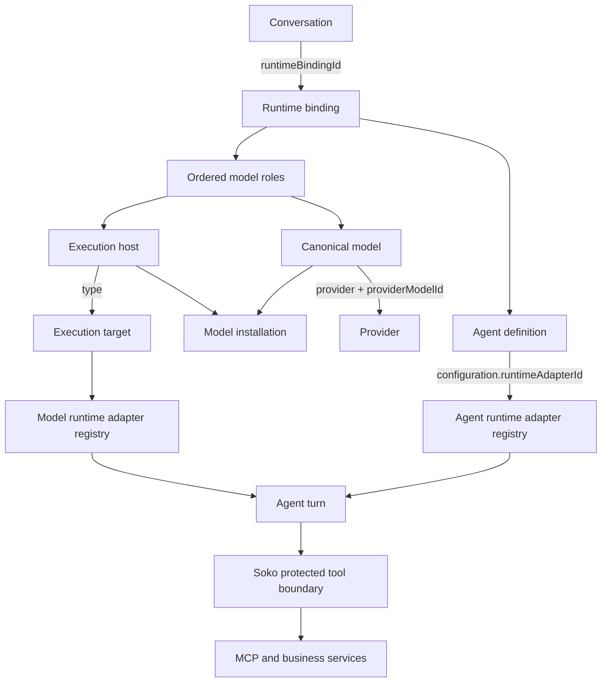
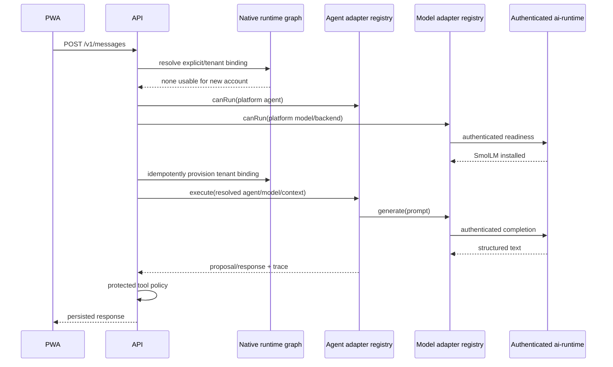

# Swappable agent and model runtime

## Status and invariant

This document describes the native runtime after the Pi/SmolLM hosted-default rollout. The
permanent invariant is:

```text
Agent != Model != Execution Target != Execution Host != Provider
```

Pi is a default, not a dependency. SmolLM is a default, not a dependency. Neither identity is
interpreted by the PWA, conversation schema, inference-host topology, or tool executor.

## Authoritative graph



PostgreSQL stores the graph in `cp2_native_runtime_agents`, `cp2_native_runtime_models`,
`cp2_native_execution_hosts`, `cp2_native_model_installations`,
`cp2_native_runtime_bindings`, and `cp2_native_runtime_binding_models`. Both normalized
conversation stores retain a binding reference. Model weights, caches, executables, provider
credentials, and private endpoints are not part of this graph.

The former Execution Fabric remains retired. `cp2_agent_model_bindings` is a compatibility input
for existing users, not a second turn router.

## Concepts

- **Agent**: portable identity, instructions, capabilities, tools, memory and permission intent.
  A native agent record declares a runtime adapter ID; it does not declare a model, host, binary,
  command, credential, or device.
- **AgentRuntimeAdapter**: an in-process harness implementation selected from a registry by the
  resolved agent's declared adapter ID. It receives resolved turn state and a bounded model
  completion callback. It does not query arbitrary database state or mutate business data.
- **Model**: canonical Soko model identity and capability metadata. Its provider mapping is
  independent from where it runs.
- **ModelRuntimeAdapter**: execution-target implementation with `canRun`, `healthCheck`, and
  `generate`. Backend providers remain behind this boundary.
- **Provider**: engine/vendor that fulfills inference, such as Ollama. It is model metadata and an
  adapter implementation detail, never an execution target.
- **Execution target**: provider-neutral location class: `backend`, `browser-local`,
  `installed-app`, or `remote-shop-device`.
- **Execution host**: a concrete authorized target instance. It carries scope, health and a
  credential reference, but never a credential value.
- **Runtime binding**: stable composition of one agent slot with ordered model/host roles and
  execution policy. Swapping a model or host does not require changing the conversation.
- **PortableAgentManifest**: device-independent declarative agent package. Validation rejects
  commands, executable paths, device/host IDs, credentials, private endpoints and provider model
  IDs. A separate native record chooses the installed runtime adapter.

## Adapter composition

```text
AgentRuntimeAdapterRegistry             ModelRuntimeAdapterRegistry
  pi                                      backend:model-id
  soko                                    browser-local:model-id
  future OSS adapters                    installed-app:model-id
                                          remote-shop-device:model-id
                \                       /
                 resolved runtime binding
                          |
                       agent turn
```

The turn pipeline has no branches for Pi, SmolLM, Ollama, or a device. Adding adapter B means
registering adapter B and declaring `runtimeAdapterId: "adapter-b"` on an agent record. Adding
model B means catalog/provider mapping plus a compatible model adapter. Moving a model changes the
binding's model/host role, not the model identity.

Pi is registered as `pi`. The existing Soko orchestration path is retained as the independently
registered `soko` adapter for explicit existing bindings and rollback. The initial platform agent
record is `builtin:pi:v1` with `configuration.runtimeAdapterId = "pi"`.

## Platform default policy and precedence

One server-side policy supplies the bootstrap candidate:

```text
agentId: builtin:pi:v1
agentRuntimeAdapterId: pi
modelId: smollm2-360m
executionTarget: backend
```

The policy is operator-configurable through server configuration and represented in the native
catalog/binding graph. Client code does not contain it. Effective selection preserves this order:

1. a conversation's explicit binding;
2. an active account/shop binding;
3. explicit agent/model/execution preferences;
4. an existing tenant default binding;
5. the platform default policy.

Availability is evaluated after preference resolution. A temporarily unavailable explicit
binding is not rewritten to the platform default. Fallback happens only through roles/policy
already recorded on that binding.

## Capability and authority boundaries

The model requirement for the generic agent loop is `chat`. `tool-routing` is an agent/runtime
capability: Pi or another harness assembles the prompt and interprets structured output. SmolLM
does not gain a false secure-tool-routing capability.

```text
agent harness -> model generation -> untrusted structured interpretation
              -> allow-list/validation -> authorization -> confirmation
              -> canonical tool executor -> audit
```

Model text can propose an operation. It cannot execute it. Write tools still require the same
membership permission, schema validation and confirmation checks as deterministic requests.

## First connected chat



No WebGPU, WASM download, native bridge, owner node, agent download, model activation, or settings
visit is required. Offline and local execution remain optional explicit choices.

## Failure and observability

Agent-adapter absence, agent unavailability, contract mismatch, unavailable target, unreachable
host, missing/loading/corrupt model, timeout and malformed output map to the existing normalized
runtime error/trace contract. The API stays live when inference is unavailable. No provider/model
substitution occurs unless the binding has an eligible fallback.

Turn telemetry records runtime binding, agent, agent adapter, canonical model, execution target,
execution host, model provider, latency, fallback index and normalized failure code. It excludes
service tokens, credentials, provider keys, raw secret-bearing prompts and private user secrets.
