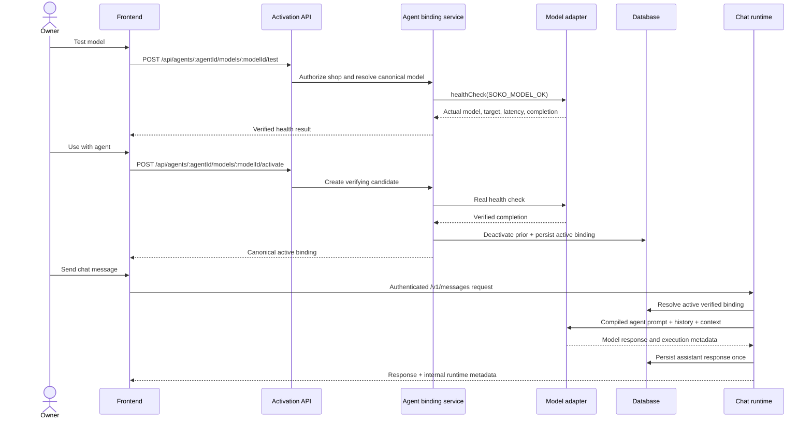

# Model activation and runtime binding

## Activation sequence



## Source of truth and states

The source of truth is `cp2_agent_model_bindings`, represented by
`AgentModelBindingSummary`. A model registry record means that a model can be selected or installed;
it does not mean the model is active for an agent.

- `verifying`: candidate health check is running.
- `active`: the candidate passed a real inference check and is the single active binding.
- `inactive`: a previously active binding replaced by a verified candidate.
- `failed`: verification returned an invalid result.
- `unavailable`: the configured runtime could not be reached.

Failed replacements are retained for diagnostics and do not deactivate the working binding.

## APIs

### Test without mutation

`POST /api/agents/:agentId/models/:modelId/test`

```json
{
  "shopId": "shop-id",
  "executionTarget": "backend"
}
```

The response contains the actual canonical model ID, provider, execution target, latency, bounded
preview, and verification timestamp.

### Activate

`POST /api/agents/:agentId/models/:modelId/activate`

```json
{
  "shopId": "shop-id",
  "executionTarget": "backend",
  "executionMode": "LOCAL_FIRST",
  "permissions": {
    "allowInstalledApp": false,
    "allowRemoteShopDevice": false
  }
}
```

The API authenticates the owner, verifies shop-agent ownership and the canonical model, validates
route permissions, runs real inference, and only then changes the active binding. There is no
automatic escalation to another model on failure - a failed model surfaces a routing error;
activating a different model is a deliberate follow-up action, not something the API does for you.

`GET /api/agents/:agentId/model-binding?shopId=:shopId` returns the canonical reload-safe state.

`DELETE /api/agents/:agentId/model-binding?shopId=:shopId` idempotently removes the active binding.
It returns `{ binding: null }`, keeps the historical row as `inactive` for auditability, and does
not remove device-local model files.

## Adapter contract

`ModelRuntimeAdapter` in `services/api/src/inference/model-runtime.ts` provides:

- `canRun(context)` for target/model availability;
- `healthCheck(context)` for a real `SOKO_MODEL_OK` completion;
- `generate({ context, prompt })` for inference with model, provider, target, token and latency
  metadata.

The backend adapter uses the authenticated Soko private-inference gateway, not Ollama directly. It
calls `/health/ready`, `/v1/models/:modelId/probe`, and `/v1/chat/completions`, applies separate
connect and generation timeouts, supports caller cancellation, retries only readiness, and rejects
HTTP failures, empty output, malformed output, and provider-model identity mismatches.

The existing OpenAI provider is adapted without exposing its credential to the browser.

## Chat routing

Normal server agent chat:

1. authenticates the account and resolves the shop;
2. loads the single active verified binding;
3. loads the agent profile, personality, instructions, context, memory, and enabled skills;
4. resolves the execution target and adapter deterministically from the saved model and binding -
   see `resolveExecutionTarget` in `services/api/src/cp2/domains/agent-runtime/
   native-runtime-routing.ts` and docs/architecture/provider-neutral-runtime.md;
5. performs inference;
6. parses the typed response/tool proposal;
7. applies role, policy, and confirmation gates;
8. persists one assistant response;
9. returns internal model/binding/target/latency metadata.

An unbound agent returns `AGENT_MODEL_NOT_CONFIGURED`. An unavailable bound adapter returns
`AGENT_MODEL_UNAVAILABLE`. There is no automatic escalation to another model or provider on
failure - a failed model surfaces one of those errors and the request ends there. Explicitly
activating OpenAI (or any other model) for the agent is the only way it is ever used; it is a
deliberate configuration choice, never something the API falls back to on its own.

Authentication, authorization, tenant, invalid request, policy, and confirmation failures all
surface as their own distinct errors, same as any other request.

## Local runtime limitations

- Browser-local inference is build-time gated. When disabled, the UI renders no interactive
  checkbox and no model is downloaded.
- Browser downloads remain explicit and lazy.
- Downloaded GGUF artifacts run through Wllama's worker-backed llama.cpp/WASM runtime in compatible
  Chromium browsers. The installed-app contract remains `window.SokoAgentModelRuntime` and is used
  when a trusted native bridge is present.
- Device activation, restoration, and chat share one runtime registry and are bounded by finite
  load/generation deadlines. A timeout terminates the Wllama worker and projects to
  `activation_failed`; it cannot leave the model card in `activating` indefinitely.
- Owner-node inference remains restricted to authenticated, current-heartbeat devices registered
  for the same tenant, agent, and model.

## Environment

Frontend build-time:

- `VITE_BROWSER_LOCAL_INFERENCE_ENABLED`
- `VITE_INFERENCE_CLIENT_FIRST`
- `VITE_INFERENCE_NATIVE_BRIDGE_ENABLED`
- `VITE_INFERENCE_OWNER_NODE_ENABLED`

Server runtime:

- existing `INFERENCE_OWNER_NODE_*` and `INFERENCE_CLOUD_*` settings
- `OPENAI_API_KEY` only when explicitly activating an OpenAI model for an agent

The generic `BACKEND_INFERENCE_*` and `INFERENCE_SERVICE_TOKEN` settings remain available for a
deliberately self-hosted runtime, but the production Render Blueprint does not set them or
provision such a service. Paid OpenAI usage is not enabled by these binding changes; it requires
someone to explicitly activate an OpenAI model for the agent.

## Local verification

1. Run an Ollama-compatible server and load the configured provider model.
2. Set `BACKEND_INFERENCE_ENABLED=true` and configure the backend variables.
3. Run `pnpm db:migrate`.
4. Start the API and web app.
5. Open Agent model settings.
6. Test Qwen, activate it, reload, and confirm the binding remains active.
7. Send a chat message and inspect the owner status for model, route, and latency.
8. Stop the inference process and confirm chat returns an actionable unavailable error without
   substituting another provider.

## Render verification

Render is the control plane and optional OpenAI proxy for explicitly-activated OpenAI models. It
does not host the downloaded model or configure `BACKEND_INFERENCE_BASE_URL`. Verify browser
WebGPU/WASM inference on the target device, then confirm that structured tool proposals are
authorized by the API without server-side regeneration. Keep OpenAI unselected unless the API key,
allowlist, and owner activation are all intentionally configured.

## Troubleshooting

- `RUNTIME_UNAVAILABLE`: endpoint disabled, unreachable, or model adapter absent.
- `MODEL_NOT_INSTALLED`: configured provider model is not installed on the backend.
- `MODEL_IDENTITY_MISMATCH`: the backend responded using a different model.
- `MODEL_HEALTH_CHECK_FAILED`: inference completed without the readiness marker.
- `INFERENCE_TIMEOUT`: increase the timeout only after checking load time and host capacity.
- `BRIDGE_UNAVAILABLE`: open the supported installed app after its native bridge is implemented.
- `BROWSER_RUNTIME_DISABLED`: use a deployment built with browser inference enabled.
