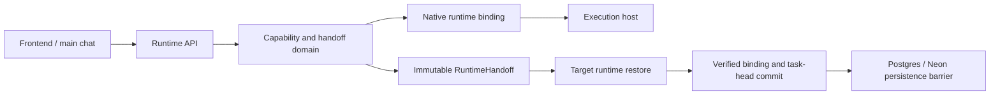

# Hosted and local runtime handoff

This is the canonical hosted/local transition contract. Execution location is independent of the
agent and model. Handoffs use the native runtime binding graph and the existing immutable
`RuntimeHandoff`; they do not create an inference provider or another execution framework.

## Architecture and storage



Native entities remain `cp2_native_runtime_agents`, `cp2_native_runtime_models`,
`cp2_native_runtime_bindings`, `cp2_native_runtime_binding_models`,
`cp2_native_execution_hosts`, and `cp2_native_model_installations`. Runtime state remains in
`cp2_runtime_handoffs`, `cp2_runtime_task_heads`, `cp2_runtime_task_instances`, and
`cp2_runtime_operation_dedup`. Migration 085 adds **transfer progress**,
`cp2_runtime_transfers`; it does not replace or mutate portable checkpoints.

The CP2 store has a **single writer process**. Its synchronous compare-and-swap and per-task
execution/transfer exclusion are the concurrency boundary. The snapshot writer's advisory lock
serializes database writes; LISTEN/NOTIFY does not synchronize independent in-memory stores.
Do not run multiple writer API instances; see [the existing store limit](../single-instance-store-ceiling.md).
The database additionally enforces one nonterminal transfer per task and unique account/task
idempotency keys. Terminal transfer updates are persisted before new active operations.

## Capability discovery and host registration

`GET /v1/runtime/:taskId/capabilities` is authenticated, scoped to the conversation and business,
and never waits for an absent local executor. `x-soko-device-id` identifies the requesting device.
Example for an installation without a local executor:

```json
{
  "hosted": [
    {
      "executionHostId": "hosted-id",
      "type": "backend",
      "supported": true,
      "configured": true,
      "available": true,
      "healthy": true,
      "reachable": true,
      "active": true,
      "reason": null
    }
  ],
  "local": [],
  "handoff": { "supported": false, "available": false, "reason": "LOCAL_RUNTIME_NOT_REGISTERED" },
  "activeExecutionHostId": "hosted-id",
  "activeTransfer": null
}
```

Capabilities are reported per host: support, configuration, registry health, reachability,
compatibility/availability, and active state are distinct. Hosted readiness is checked again with
the actual model adapter's `healthCheck` and agent harness's `canRun` before return commit.
Local means browser/browser-local, installed-app, or remote-shop-device. Hosted model transports
remain generic; model/provider identity does not determine local portability.

Provisioning must create an account/business-owned host in the existing native graph, install the
same model, declare `runtime-handoff-v1` in its capabilities, and assign
`configuration.deviceId`. This is a trusted installer responsibility. A model-only installation
must not declare full runtime portability. Existing fields supply identity, ownership, capabilities,
health, timestamps and metadata; no parallel host registry is introduced.

Trusted application code supplies an executable `LocalHandoffHost` using
`registerLocalHandoffHost`. The adapter must implement compatibility, preparation, exact-checkpoint
restore, local turns with tool policy, and idempotent conversation-event synchronization.
`POST /v1/runtime/:taskId/hosts/:hostId/heartbeat` with `{ "connected": true }` refreshes a
45-second lease only for an already provisioned host assigned to that device. `false` disconnects
it. It cannot create a host, enable a disabled host, install models, or grant capabilities.
A missing bridge or expired lease is unavailable. The frontend checks its actual registered
adapter as well, and renews the lease immediately before commit.

**This checkout does not ship a full LocalHandoffHost executor or installer.** The Android app is
not a runtime WebView bridge. The independent browser model and business-data cache do not satisfy
this contract. Deployments without a compatible adapter correctly report unavailable. Executable
test adapters exercise the transition contract; they are not a live-device inference certification.

## Transfer API and lifecycle

All paths below have prefix `/v1/runtime/:taskId`. The task is the existing conversation ID.
Mutation requests use the owning account's authenticated session and `x-soko-device-id`.

| Request                        | Contract                                                                                                                                   |
| ------------------------------ | ------------------------------------------------------------------------------------------------------------------------------------------ |
| `GET /capabilities`            | Host capabilities, canonical active host and active transfer                                                                               |
| `POST /handoffs`               | Body `{targetExecutionHostId, expectedHandoffId}`; required `Idempotency-Key` header; 202 with transfer record, or deterministic 4xx       |
| `GET /transfers/:id`           | Current transfer including status, checkpointId, expiry and structured failure                                                             |
| `GET /handoffs/:checkpointId`  | Existing immutable checkpoint retrieval                                                                                                    |
| `POST /transfers/:id/complete` | Local: `{receipt:{handoffId,agentId,modelId,harness,artifacts,protectedContext,businessState}}`; hosted: `{}` with server readiness probes |
| `POST /transfers/:id/fail`     | `{}`; fails a nonterminal operation, leaves a completed operation intact                                                                   |

A transfer includes `id`, `taskId`, account/business/device ownership, `idempotencyKey`,
`sourceHandoffId`, `checkpointId`, source/target host IDs, `status`, `failureCode`, `message`,
`createdAt`, `updatedAt`, and `expiresAt`. Receipts must match the exact checkpoint and unchanged
agent/model identities. All four resource-readiness booleans must be true for a local commit.
Device receipts are assertions from the authenticated owner's trusted adapter, not remote attestation.

```text
PENDING -> CHECKPOINTING -> CHECKPOINTED -> TARGET_ACTIVATING
        -> RESTORING -> VERIFYING -> COMPLETED
Any nonterminal state -> FAILED
```

Transitions are validated in code. Progress lives on the transfer, never on the immutable
checkpoint. No client-supplied arbitrary status is accepted. The target checkpoint is created as
an unpromoted branch with the source as its parent. The source remains canonical while the local
adapter prepares business data, prepares resources, and restores the exact destination checkpoint.
The backend revalidates host availability, ownership and the source head, then commits binding,
head and runtime instance together. Source routing changes only after a confirmed commit.
There is no source-stop-before-target-start call.

An executing hosted turn is never split around a tool call: transfer creation rejects immediately
with `HANDOFF_IN_PROGRESS`, and the source continues to its safe checkpoint boundary. New turns
are excluded during an active transfer, and hosted turns reject when local execution is canonical.
Completed turns save a cursor/state, action IDs/status and durable turn references. Tool inputs,
confirmation tokens and raw tool results are not copied into checkpoints. Pending tool actions
must be reauthorized. On hosted continuation, the selected checkpoint is passed into the existing
model route as task data, without granting tool authority. Protected context is fetched through
its existing authorization boundary, never embedded by the transfer service.

Local return first synchronizes business changes, messages with original IDs, and causal offline
checkpoints using the existing `/checkpoints/sync` API. Unresolved conflicts preserve local state.
The hosted adapter is health-checked before the source is replaced. Transcript, checkpoints and
business data are retained after successful synchronization.

## Deadlines, retries and recovery

Transfer lifetime is two minutes. Reading/retrying an expired operation marks it FAILED; a late
completion can never commit it. There is no detached migration worker or unbounded server polling.
The local adapter drives preparation after a 202 response. Its compatibility, prepare and restore
waits each have a 15-second bound. Server readiness probes have a five-second deadline with an
abort signal; a late probe has no authority to commit. The normal persistence response deadline
is eight seconds. Runtime responses, including recovery reads, require the persistence barrier;
a pending flush returns 503 `RUNTIME_PERSISTENCE_PENDING`, not a successful activation ACK.
The frontend's existing 20-second network safeguard is unchanged.

The operation's key and ID are stored in the existing account/business/device IndexedDB session.
Repeated requests with the same account/task/key and payload return the same operation. A changed
target, source checkpoint or device with the same key returns `HANDOFF_CONFLICT`. Crossing
transfers are rejected. `expectedHandoffId` also protects against stale clients.

After refresh a saved prepared operation offers **Resume handoff** and **Go hosted**. Resume
reloads the operation and restores its exact checkpoint, including a commit whose response was
lost. An abandoned operation can be failed while its source stays canonical. A lost completion
response never triggers rollback of a completed operation. Returning sessions retain their branch
until hosted resume is confirmed. This is explicit recovery, not background indefinite polling.

| Failure                                                  | Behavior                                            |
| -------------------------------------------------------- | --------------------------------------------------- |
| No host / unsupported runtime                            | Immediate 409, no checkpoint and no wait            |
| Host lease expires or host disconnects during activation | FAILED; source binding/head preserved               |
| Checkpoint insertion fails                               | `CHECKPOINT_FAILED`; source preserved               |
| Wrong/missing local receipt                              | `RESTORE_FAILED`; source preserved                  |
| Hosted adapter absent, unhealthy or hanging              | Activation failure/timeout; local remains canonical |
| Source head changes                                      | `HANDOFF_CONFLICT`; never overwrite the new head    |
| Duplicate or conflicting request                         | Reuse canonical operation or return 409             |
| Database confirmation pending                            | 503; reload operation before changing routing       |

Other codes include `LOCAL_RUNTIME_UNSUPPORTED`, `LOCAL_RUNTIME_NOT_REGISTERED`,
`LOCAL_RUNTIME_OFFLINE`, `LOCAL_RUNTIME_UNHEALTHY`, `NO_EXECUTION_HOST`,
`HANDOFF_RESTORE_REQUIRED` (legacy host swap), `TARGET_ACTIVATION_FAILED`,
`TARGET_ACTIVATION_TIMEOUT`, `RUNTIME_HOST_FORBIDDEN`, and `RUNTIME_OWNER_REQUIRED`.
Existing native agent/model/install compatibility codes are reused.

## Frontend and offline semantics

Settings renders the canonical Hosted/Local state and backend capability explanation. An unavailable
local target disables Go offline; Refresh runtime retries discovery. The UI does not present an
installer that does not exist. Switching states prevent repeated taps, and the backend verifies
again regardless of frontend state. Saved operations remain recoverable across page refreshes.

Go offline means moving this conversation's execution to a compatible local host. It does not
log out the account, erase hosted data, or disable eventual synchronization. Existing local tools,
permissions, conflict resolution, protected-context and owner PIN boundaries remain in force.

## Observability and diagnosis

Audit events include `runtime.handoff_requested`, `runtime.handoff_rejected`,
`runtime.checkpoint_started`, `runtime.checkpoint_created`, `runtime.target_activation_started`,
`runtime.restore_started`, `runtime.restore_completed`, `runtime.handoff_completed`, and
`runtime.handoff_failed`. Payloads contain transfer/task/host/business IDs, duration and failure
code. They do not include checkpoint contents, credentials, tokens, PINs or protected files.

The reported generic timeout string originates in `apps/web/src/lib/api.ts`'s 20-second
AbortController. In the original checkout, `useRuntimeHandoff` returned the installation-disabled
message **before making a handoff HTTP request**. Therefore that message and a settings request
timeout do not prove the same failing operation. The settings surface independently loads the
agent profile, readiness, versions, context sources, evaluations and corrections. The effective
runtime readiness and model test/activation paths also awaited unbounded adapter promises; they are now bounded. No production
request ID, trace or failed URL was supplied, so the precise production stall is not established.

Additional confirmed defects fixed here: no canonical backend capability API; legacy host swap
committed before activation validation; missing handoff methods in the Postgres persistence
mutation list; and successful runtime ACKs previously permitted after an unconfirmed flush.
